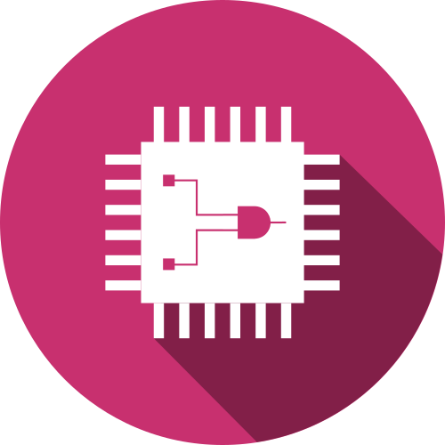
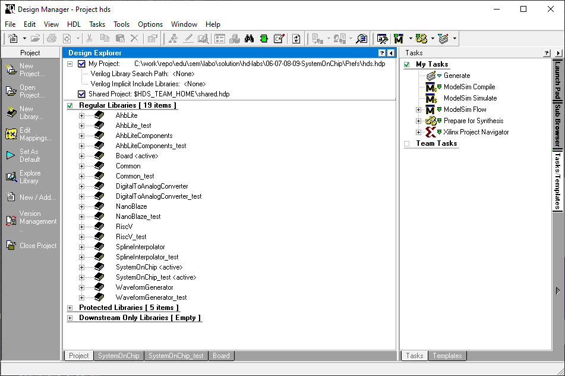
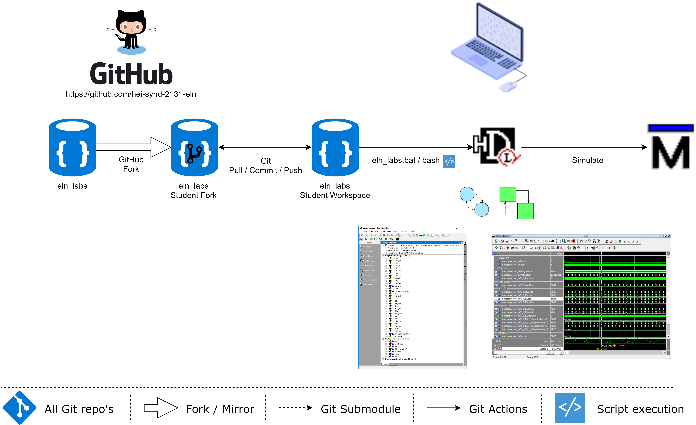

<h1 align="center">
  <br>
  
  <br>
  Hevs SEm Laboratories
  <br>
</h1>

<h4 align="center">Labor Files for SEm Laboratories practical sessions <a href="https://cyberlearn.hes-so.ch" target="_blank">Moodle Cyberlearn</a>.</h4>

# Table of contents
<p align="center">
  <a href="#description">Description</a> •
  <a href="#how-to-use">How To Use</a> •
  <a href="#download">Download</a> •
  <a href="#credits">Credits</a> •
  <a href="#license">License</a> •
  <a href="#fund-us-on">Find us on</a>
</p>



## Description
[(Back to top)](#table-of-contents)

Laboratory file for course 225-sem for the third year bachelor students.

Moodle Link
* [Moodle SYND](https://cyberlearn.hes-so.ch/course/view.php?id=14279)

## How To Use
[(Back to top)](#table-of-contents)

To clone and run this application, you'll need [Git](https://git-scm.com) and [HDL Designer](https://www.mentor.com/products/fpga/hdl_design/hdl_designer_series/) as well as [Modelsim](https://www.mentor.com/products/fv/modelsim/) installed on your computer. From your command line:



### Launch
```bash
# Change to location for the Sourcecode on your PC for Example Base of Drive U:
U:

# Clone this repository
git clone https://github.com/hei-synd-225-sem/sem_labs.git

# Go into the repository project. There are 7 different projects located in 7 subfolders
cd sem-labs/

# Project WaveformGenerator
cd 01-WaveformGenerator
# Run the app
## Linux
./waveformGenerator.bash
## Windows
.\waveformGenerator.bat

# or Project SplineInterpolator
cd 02-SplineInterpolator
# Run the app
## Linux
./splineInterpolator.bash
## Windows
.\splineInterpolator.bat

# or Project DAC
cd 03-DigitalToAnalogConverter
# Run the app
## Linux
./digitalToAnalogConverter.bash
## Windows
.\digitalToAnalogConverter.bat

# or Project Lissajous
cd 04-Lissajous
# Run the app
## Linux
./lissajous.bash
## Windows
.\lissajous.bat

# or Project Morse
cd 05-Morse
# Run the app
## Linux
./morse.bash
## Windows
.\morse.bat

# or Project SoC
cd 06-07-08-09-SystemOnChip
# Run the app
## Linux
./systemOnChip.bash
## Windows
.\systemOnChip.bat

# or Project PipelinedOperators
cd 10-PipelinedOperators
# Run the app
## Linux
./pipelinedOperators.bash
## Windows
.\pipelinedOperators.bat
```

### Update Student **Fork** to the latest modification from **Master** Repo
```bash
# goto your student fork repo location
cd u:\sem_labs\

# add upstream Master remote
git remote add upstream https://github.com/hei-synd-225-sem/sem_labs.git

# like "git pull" which is fetch + merge)
git fetch upstream
git merge upstream/master master

# Push the changes into your own fork repo
git push origin master
```

## Credits
[(Back to top)](#table-of-contents)
* COF
* ZAS

## License
[(Back to top)](#table-of-contents)

:copyright: [All rights reserved](LICENSE)

---

## Find us on
> [hevs.ch](https://www.hevs.ch) &nbsp;&middot;&nbsp;
> Facebook [@hessovalais](https://www.facebook.com/hessovalais) &nbsp;&middot;&nbsp;
> Twitter [@hessovalais](https://twitter.com/hessovalais) &nbsp;&middot;&nbsp;
> LinkedIn [HES-SO Valais-Wallis](https://www.linkedin.com/groups/104343/) &nbsp;&middot;&nbsp;
> Youtube [HES-SO Valais-Wallis](https://www.youtube.com/user/HESSOVS)
